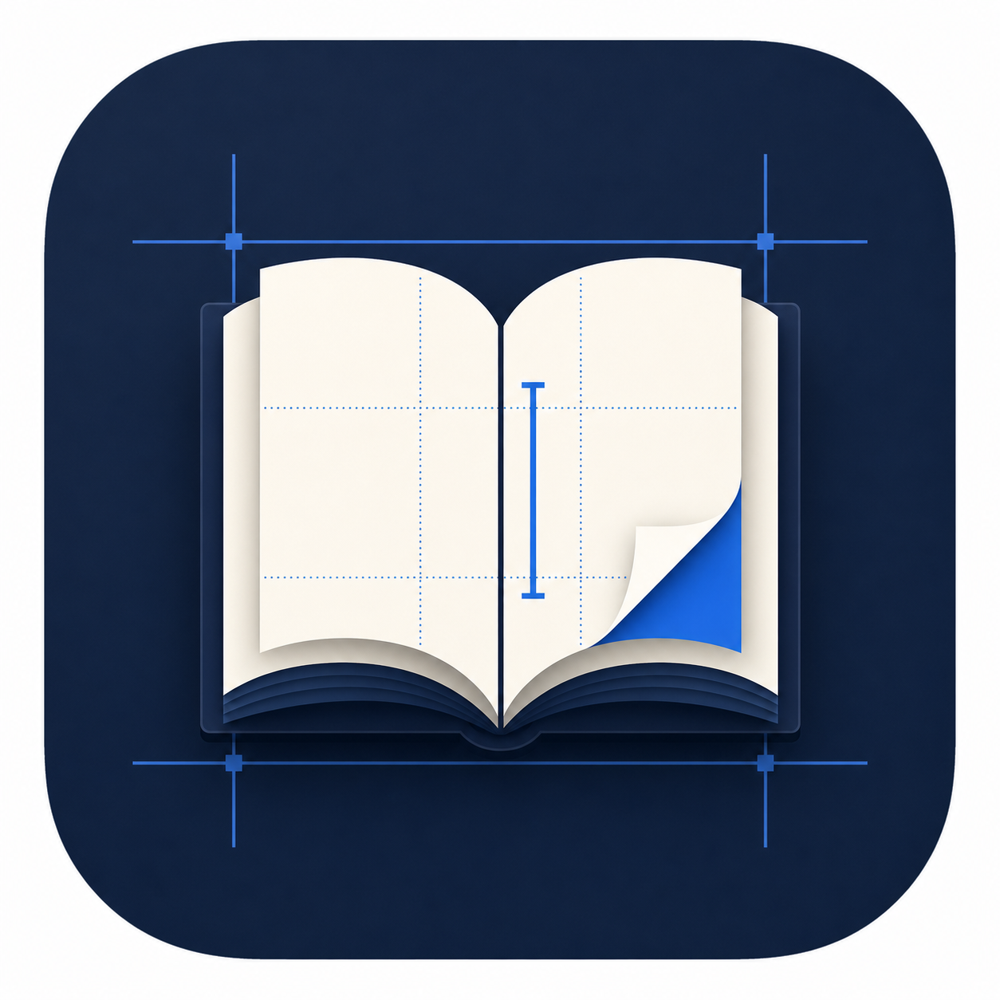

<p align="center">
  
</p>

<h1 align="center">Typesetly</h1>

<p align="center">
  A private, local-first studio for writing, planning, formatting, previewing, and publishing books.
</p>

<p align="center">
  <a href="https://github.com/CosmicDerivative/Typesetly/releases/latest">
    
  </a>
  <a href="LICENSE">
    
  </a>
</p>

Typesetly combines a structured manuscript editor, visual story-planning tools, realistic reader previews, and publication export in one application. Books remain on your device, and no account or cloud service is required.

> [!IMPORTANT]
> Typesetly is an independent project and is not affiliated with, endorsed by, or sponsored by any commercial writing application.

## Highlights

- Rich-text manuscript editing with chapters, Parts, scenes, front matter, back matter, custom pages, images, footnotes, verse, quotations, callouts, and message bubbles
- Dedicated **Draft**, **Plan**, **Organize**, **Design**, and **Publish** workspaces
- Drag-and-drop manuscript organization, folders, named scenes, and recoverable Trash
- Character, location, worldbuilding, relationship, mind-map, and live mention tools
- Sticky notes linked to books, pages, scenes, highlighted text, characters, and worldbuilding records
- Custom book themes and realistic phone, tablet, e-reader, and print previews
- EPUB, print PDF, and DOCX export with publication checks
- DOCX and Scrivener import, plus Scrivener External Folder Sync in the desktop application
- Writing goals, habits, word history, sprints, find and replace, smart punctuation, and revision history
- Multiple light, dark, solarized, high-contrast, and distraction-reducing workspace themes
- Local snapshots and automatic recovery points without accounts, analytics, or cloud storage

## Download

Download the newest Windows, macOS, or Linux build from the [Typesetly Releases page](https://github.com/CosmicDerivative/Typesetly/releases/latest).

- **Windows:** choose the Setup executable for a normal installation or Portable to run without installing.
- **macOS:** choose the DMG for your Mac. Intel and Apple Silicon builds are provided.
- **Linux:** choose AppImage for a portable application or DEB for Debian-based distributions.

Unsigned builds may display an operating-system security warning. Only install downloads obtained from the official Typesetly repository.

## Run from source

Running from source requires Node.js 22 or newer and npm 10 or newer.

```powershell
git clone https://github.com/CosmicDerivative/Typesetly.git
cd Typesetly
npm.cmd install
npm.cmd start
```

On macOS or Linux, use `npm install` and `npm start`. On Windows, `npm.cmd` avoids the PowerShell execution-policy error that can block `npm.ps1`.

## A quick tour

- **Draft** is the main writing workspace.
- **Plan** opens characters, worldbuilding, relationships, mentions, and the mind map.
- **Organize** provides a full manuscript board for arranging pages and scenes.
- **Design** controls typography, chapter styling, ornaments, margins, headers, and previews.
- **Publish** runs publication checks and exports the finished book.

The command shelf provides quick access to the outline, review tools, history, search, goals, notes, settings, quotations, and proofing. Drawers can be pinned beside the manuscript, and Typesetly remembers pinned tools after a refresh or restart.

Press `F1` or choose **Wiki** inside Typesetly for the complete in-app guide.

## Keyboard shortcuts

| Action | Shortcut |
| --- | --- |
| New chapter | `Ctrl/Cmd + N` |
| New Part | `Ctrl/Cmd + Shift + N` |
| Duplicate active page | `Ctrl/Cmd + Shift + D` |
| Move active page | `Alt + Shift + Up/Down` |
| Move active page to Trash | `Ctrl/Cmd + Shift + Delete` |
| Delete focused page or scene | `Delete` |
| Find and replace | `Ctrl/Cmd + F` |
| Editor settings | `Ctrl/Cmd + ,` |
| Toggle navigation | `Ctrl/Cmd + \` |
| Draft workspace | `Ctrl/Cmd + Alt + 1` |
| Plan workspace | `Ctrl/Cmd + Alt + 2` |
| Organize workspace | `Ctrl/Cmd + Alt + 3` |
| Design workspace | `Ctrl/Cmd + Alt + 4` |
| Publish workspace | `Ctrl/Cmd + Alt + 5` |
| Publish and export | `Ctrl/Cmd + Shift + E` |
| Confirm local save | `Ctrl/Cmd + S` |
| Download snapshot | `Ctrl/Cmd + Shift + S` |
| Help | `F1` |

Standard editor shortcuts for bold, italic, underline, undo, and redo also work.

## Organizing a manuscript

Use **Organize** for the full structure board or open **Outline** for a compact manuscript map beside any workspace.

- Create folders for drafts, alternate scenes, and research.
- Drag pages above or below compatible pages to reorder them.
- Drop chapters onto Parts to group them.
- Add scenes directly from a chapter and drag them within or between chapters.
- Drag removable pages and scenes to Trash so they can be restored later.

Title Page, Copyright, and Contents are protected pages and remain in their appropriate positions.

## Planning stories and series

The **Plan** workspace contains the Story Studio:

- **Characters** tracks roles, aliases, voice, motivation, conflict, relationships, and arcs.
- **World** tracks locations, cultures, organizations, history, technology, magic systems, creatures, and important objects.
- **Mind map** creates editable relationships between character and world records.
- **Live mentions** shows where characters and places appear throughout the manuscript.
- **Series scope** lets books share and reuse continuity information.

Series information can also be added from **Book profile**, including book number and planned series length.

## Sticky notes

Open **Notes** to create color-coded notes for the whole book or attach them to a page, scene, highlighted passage, character, or worldbuilding record.

Scene notes remain attached when scenes are reordered or moved to another chapter. Pin the Notes drawer when you want notes to remain visible beside the manuscript.

## Backups and privacy

Books and recovery revisions are stored locally in the application profile. Typesetly does not require an account and does not send manuscripts to a cloud service.

Use **Backup snapshot** regularly. Snapshots include books and custom themes and can be restored from the library screen.

Clearing browser data, deleting the desktop application profile, disk failure, or an operating-system reset can remove local manuscripts. Keep backup snapshots somewhere separate from the device.

## Scrivener compatibility

### Import a project

Choose **Import a Scrivener project** from the library, then select the complete `.scriv` project folder or a zipped Scrivener backup. Do not select the `.scrivx` file by itself.

Importing is read-only. Typesetly brings Draft or Manuscript documents into the book without modifying the original Scrivener project.

### Round-trip sync

External Folder Sync is available in the Typesetly desktop application:

1. In Scrivener, open `File > Sync > with External Folder`.
2. Select a dedicated sync folder.
3. In Typesetly, open **Book profile > Scrivener round-trip**.
4. Connect the same folder and select RTF or plain text.
5. Run sync before switching applications and choose **Sync now** after returning to Typesetly.

Typesetly writes only inside the selected external `Draft` folder. If the same document changes in both applications, Typesetly creates a separate conflict chapter instead of silently overwriting either copy.

## Help and feedback

- Press `F1` inside Typesetly for guides and troubleshooting.
- Report problems or request features through [GitHub Issues](https://github.com/CosmicDerivative/Typesetly/issues).
- Contributions are welcome; see [CONTRIBUTING.md](CONTRIBUTING.md).
- Report security concerns according to [SECURITY.md](SECURITY.md).

## License

Typesetly is available under the [MIT License](LICENSE). Third-party dependency licensing is listed in [THIRD_PARTY_NOTICES.md](THIRD_PARTY_NOTICES.md).
